<p align="center">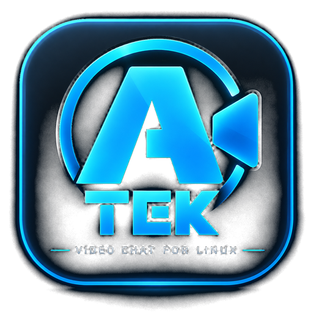</p>

<h1 align="center">atekvid</h1>

<p align="center">Private, end-to-end encrypted video chat for Linux, for a small circle of GitHub accounts.<br>
No accounts to create, no server to run, no address to type. Two laptops on a hotel Wi-Fi, a phone hotspot and a VPN, or the same living room: they find each other and talk directly.</p>

<p align="center">
<a href="#install-or-update">Install</a> ·
<a href="#what-it-does">What it does</a> ·
<a href="#screens">Screens</a> ·
<a href="#how-it-works">How it works</a> ·
<a href="#security">Security</a> ·
<a href="#libraries">Libraries</a> ·
<a href="#command-line">Command line</a> ·
<a href="#configuration">Configuration</a> ·
<a href="#troubleshooting">Troubleshooting</a>
</p>

This repository holds the installer and the signed release binaries. The
source code lives in a private repository; this page documents how the
application is built and how it behaves.

## Install or update

```sh
curl -fsSL https://raw.githubusercontent.com/MBrassey/atekvid/main/install.sh | bash
```

One line on Arch, Manjaro, CachyOS, Linux Mint, Ubuntu, Debian, Fedora,
openSUSE, Void and Alpine (x86_64). The script:

1. installs the two small system libraries the app needs (`libpulse`,
   `libopus`; present on every desktop already);
2. downloads the latest release, **verifies its Ed25519 signature** against
   the atekvid release key and its SHA-256 checksum;
3. installs `atekvid` to `~/.local/bin`, adds it to the application menu with
   the logo, and starts it in the system tray at login;
4. registers this device's key on your GitHub account when the GitHub CLI is
   signed in (GitHub asks once, in the browser); otherwise the app does it at
   first start.

Prefer not to pipe from the network? Download the release archive, check the
`.sig` and `.sha256`, extract, and run `./install.sh` from it. `install.sh
--help` lists the options (`--prefix`, `--no-autostart`, `--uninstall`, …).

**Updating** happens by itself: the app checks these releases shortly after
launch and every six hours, verifies the signature, installs the new binary
next to the running one and offers a restart. `atekvid update` does the same
by hand.

### Requirements

| | |
|---|---|
| CPU / OS | x86_64 Linux, glibc 2.35 or newer (Mint 21+, Ubuntu 22.04+, Debian 12+, Fedora 36+, Arch and derivatives) |
| Sound | PipeWire (`pipewire-pulse`) or PulseAudio |
| Camera | any V4L2 camera (MJPEG, YUYV, NV12, RGB); optional, a test pattern stands in |
| Display | X11 or Wayland; OpenGL 3.x |
| Tray | KDE, Cinnamon, XFCE, MATE, LXQt, Budgie; GNOME with the AppIndicator extension Ubuntu ships |
| Account | a GitHub account on the circle's allow-list, with this device's key registered as an SSH signing key |

## What it does

- **Calls** with H.264 video (up to 1080p, adapting to the connection) and
  Opus voice, direct between machines when the network allows, through an
  encrypted relay otherwise.
- **Group calls.** Call one person, then add the others from *Add people*.
  Every participant holds a direct encrypted media session with every other
  participant, everyone sees and hears everyone, and every connection has its
  own safety code.
- **Presence that is true.** *Online* means the other person's atekvid is
  open. Clients connect to each other the moment they start and drop off the
  list within seconds of closing.
- **Effects** baked into your picture, so everyone sees them: face-tracked
  props (sunglasses, hats, crown, cat and bunny ears, mustache, googly eyes…),
  funhouse warps, looks (old film, thermal, night vision, cartoon…), particles
  (hearts, snow, confetti, bubbles, sparkles), a name tag, a speech bubble,
  reaction bursts, and a CRT-style *where am I* map showing your city, nearest
  cross streets and the hotel, museum or airport you are in, tucked into a
  corner and readable in your own mirrored preview. Your own PNG overlays load
  as plugins.
- **Chat**, end-to-end encrypted per session, with Markdown, links, a custom
  emoji set drawn in the app's palette, typing indicator and delivery ticks.
  In a group call the chat drawer reaches everyone in the call.
- **Drop box.** Drag a file onto the window; the other person decides whether
  to download it. Files stream directly over the encrypted link with progress
  and previews, and land in `~/Downloads/atekvid/`.
- **Snapshots and recording** (MKV, remote video with both voices mixed),
  written from the already-encoded streams.
- **Tray.** Closing the window keeps atekvid running: calls, messages and
  files still arrive with desktop notifications, an incoming call opens the
  window, and the tray menu answers, declines, calls, invites and quits. While
  hidden with no call, the camera and microphone are released, so other
  programs can use the webcam.
- **Devices.** Camera, resolution and frame rate, microphone with meter, gain
  and noise gate, speaker with test tone, one-click echo cancellation using
  the sound server's WebRTC canceller, and a quality selector. Plug a webcam
  or a headset in while the app runs and it is picked up within a second; the
  device you chose is used again whenever it comes back.
- A launch splash, soft fades, glass surfaces, a custom title bar and window
  controls, a hand-drawn icon set, and quiet sounds for rings, messages, files
  and reactions.

Keyboard in a call: **M** mute · **V** camera · **E** effects · **C** chat ·
**D** drop box · **I** add people · **S** snapshot · **R** record ·
**F** fullscreen · **Esc** leave fullscreen · **Ctrl+Q** quit.

## Screens

<p align="center">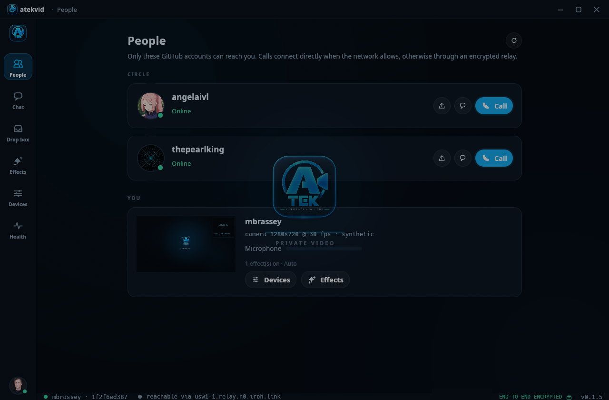</p>

**People.** The circle, who is online, and one button to call or invite.

<p align="center">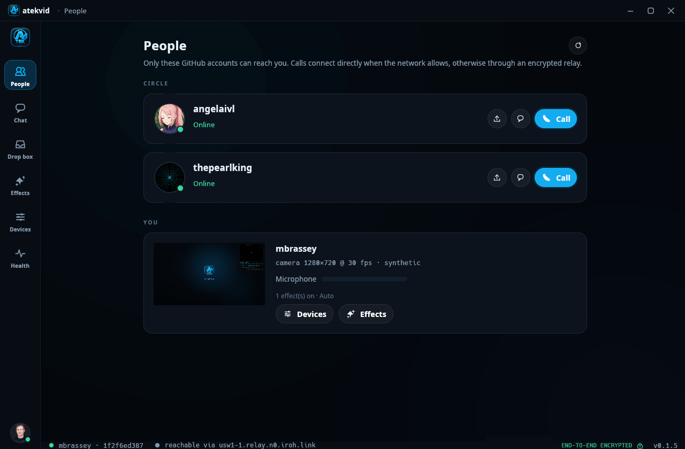</p>

**Incoming call.** Answer opens the call straight away; in a group call the
dialog says who is already in it.

<p align="center">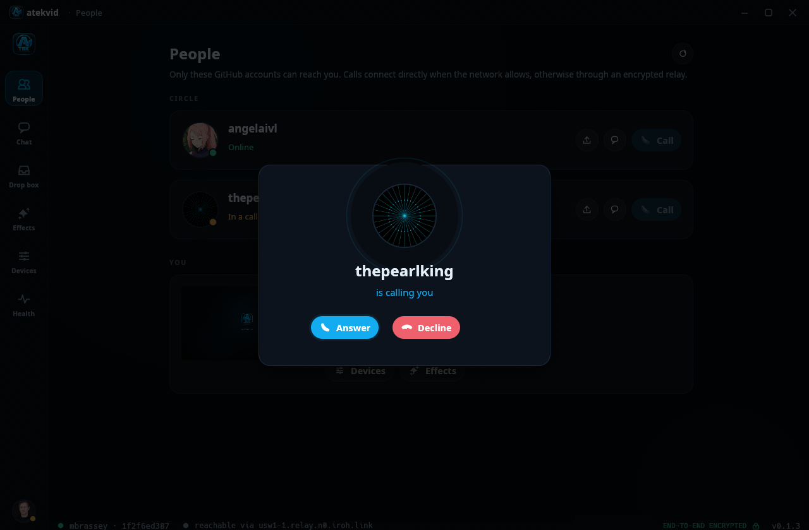</p>

**A call with two other people.** Tiles for every participant with a speaking
ring, connection quality and a name pill; your own picture in the corner; the
control bar, reactions, *Add people*, safety codes and statistics.

<p align="center">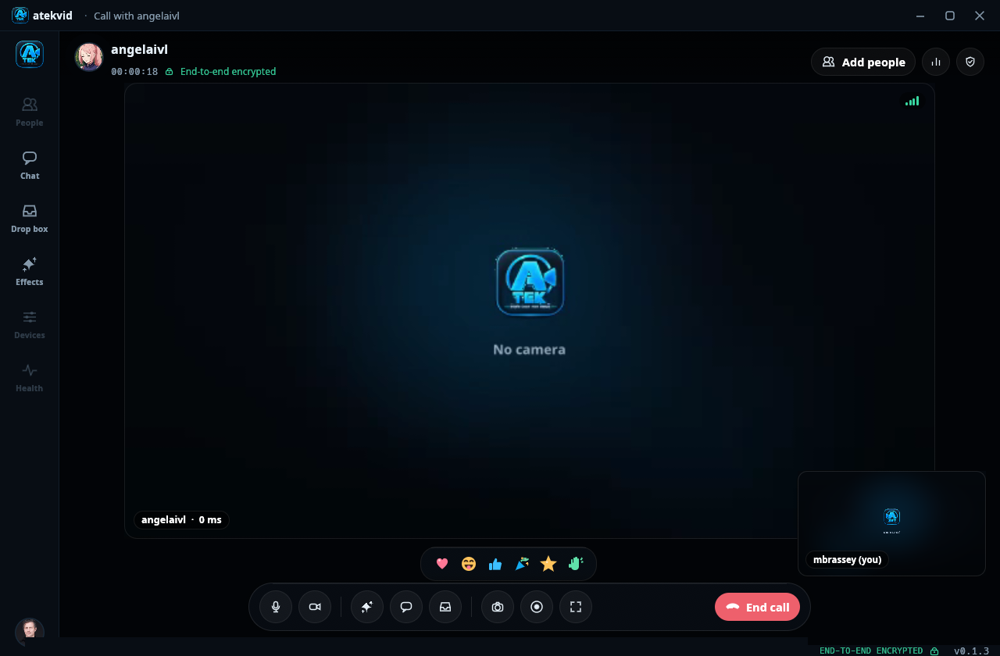</p>

**Drop box in a call.** A file offered by a participant, ready to download.

<p align="center">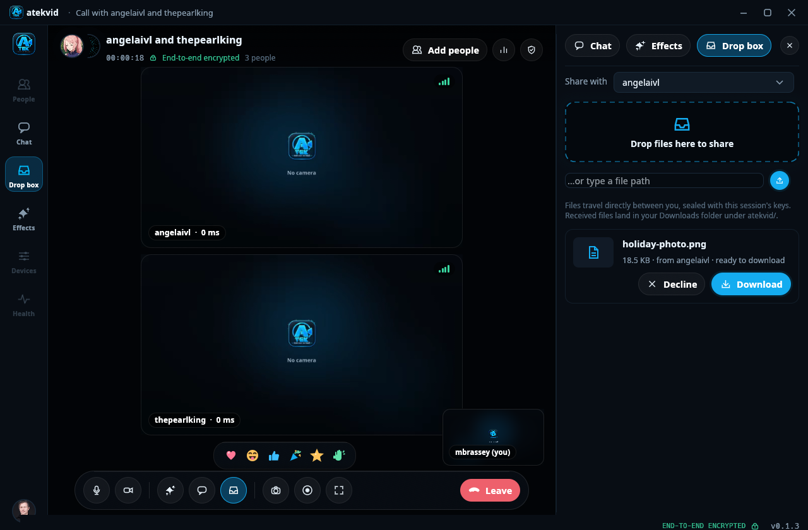</p>

**Chat in a call.** *Everyone* addresses the whole call; a name addresses one person.

<p align="center">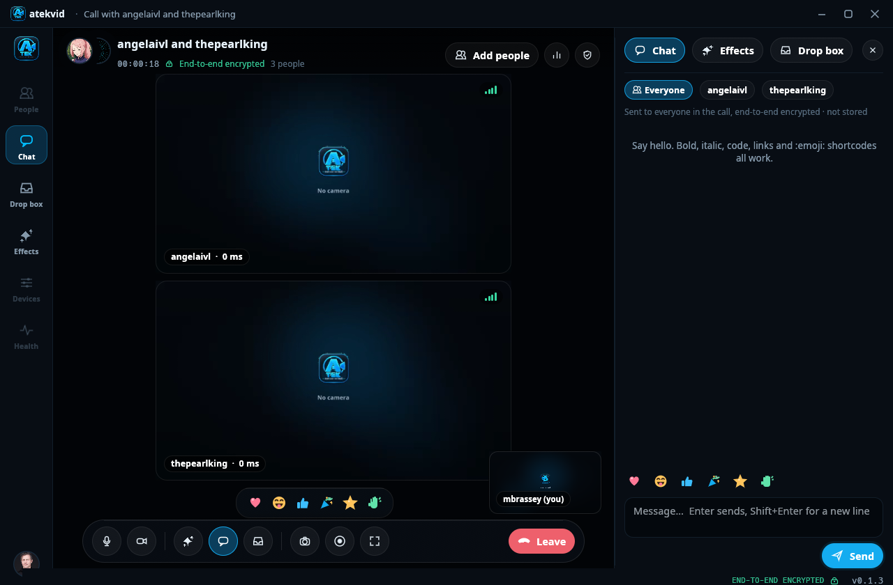</p>

**Chat, Drop box, Effects, Devices, Health.**

<p align="center">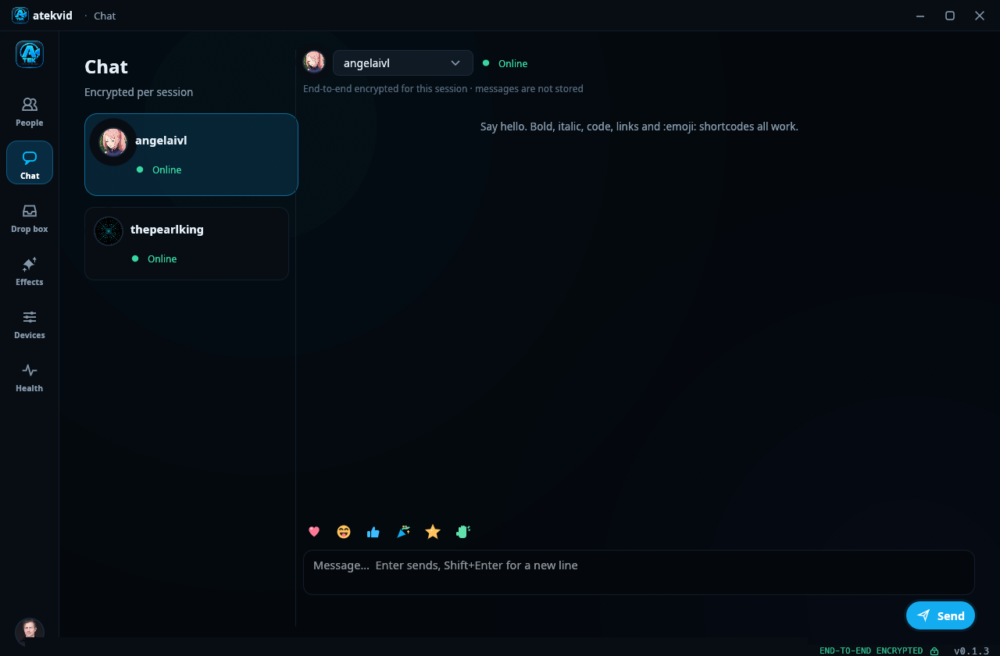</p>
<p align="center">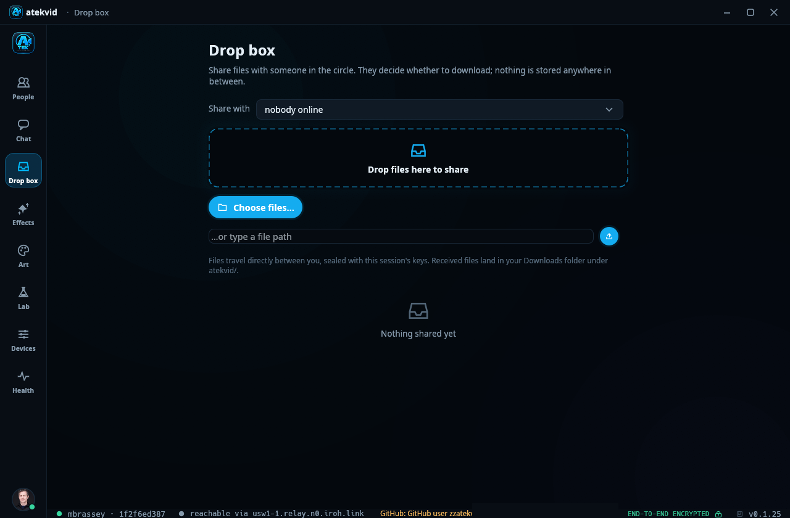</p>
<p align="center">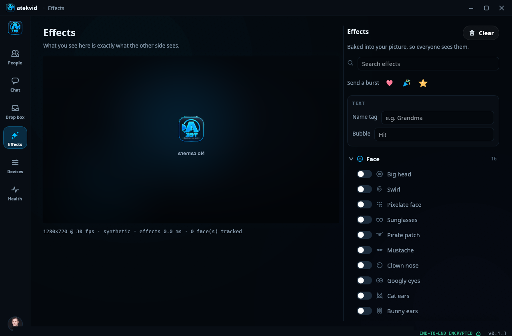</p>
<p align="center">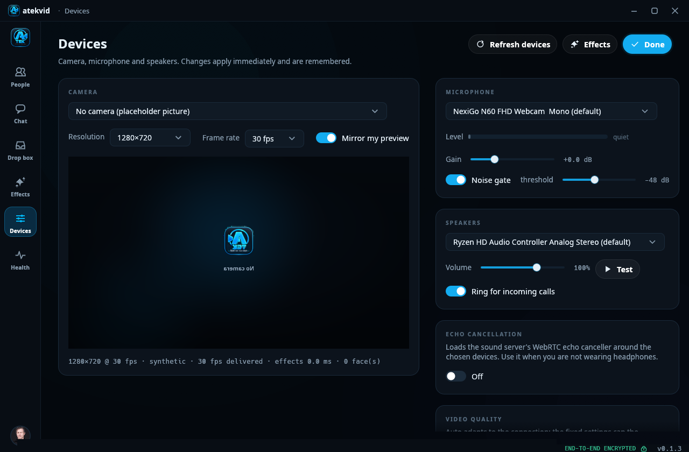</p>
<p align="center">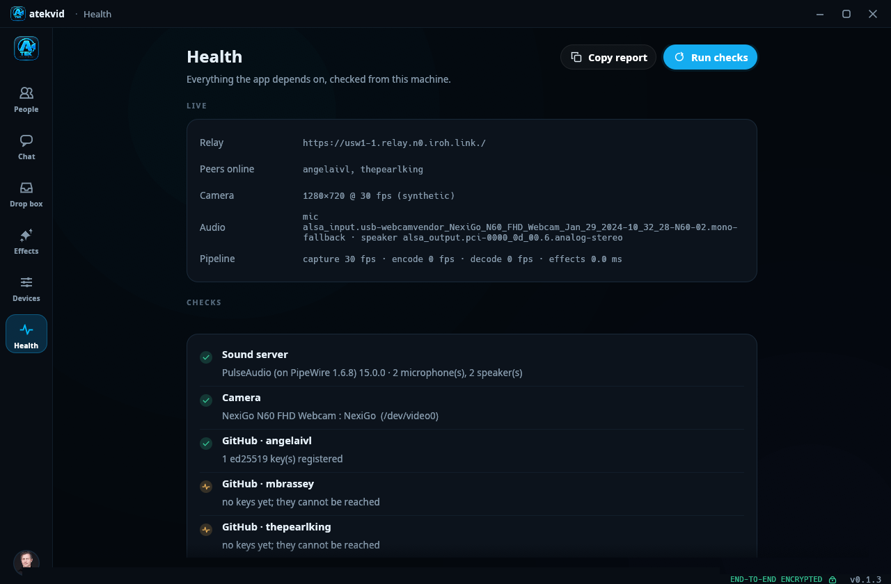</p>

**First run.** With the GitHub CLI installed, the device links itself: signed
out, it signs you in; then GitHub asks once, in the browser, whether atekvid
may add signing keys (the code is on your clipboard). Without `gh`, the key
is shown to paste on GitHub.

<p align="center">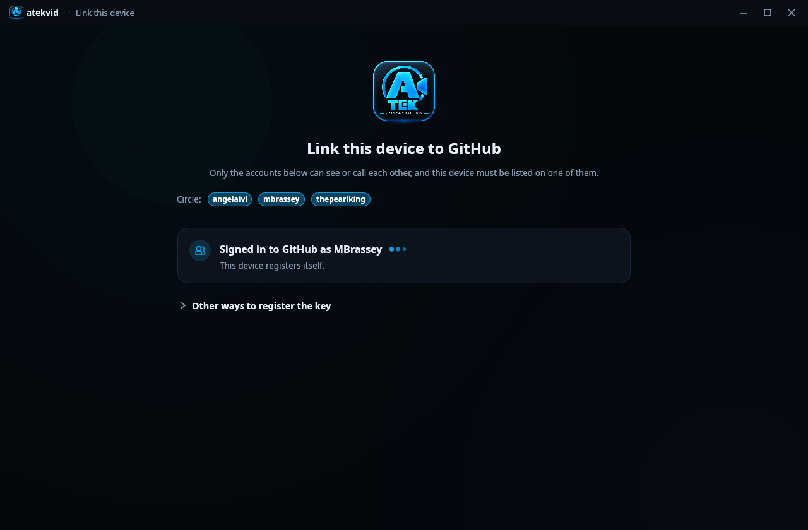</p>

## How it works

### Identity and trust

Each installation generates one Ed25519 key, stored in
`~/.config/atekvid/identity.key` (mode 0600). That key is at the same time:

- the **iroh endpoint id**, which is what peers connect to and what the QUIC
  handshake authenticates (TLS 1.3 with the endpoint key as certificate);
- an **SSH public key** the user registers on their GitHub account as a
  *signing* key (it cannot push code).

The circle is a fixed allow-list of GitHub usernames in the configuration.
The app reads each user's public keys from GitHub's public API, caches them,
and accepts a connection only from an endpoint whose key GitHub lists for one
of those users. Nothing else is trusted: no accounts, no passwords, no
directory server of its own. Removing a key on GitHub removes that device from
the circle within minutes.

### Finding each other

- **n0 address lookup** (DNS/pkarr): every endpoint publishes where it can be
  reached under its public key; peers resolve each other by key from anywhere.
- **mDNS** on the local network, so two machines on the same Wi-Fi find each
  other with no internet at all.
- Every client dials every other allow-listed key as soon as it starts and
  keeps retrying with a short back-off. Between two peers the lower endpoint
  id dials and the higher one gives it five seconds before dialling itself;
  when dials still cross, both keep the connection the lower id initiated. Links carry QUIC keep-alives every 5 s with a
  20 s idle timeout, so presence follows reality within seconds.

### Transport

Built on [iroh](https://iroh.computer) (QUIC over UDP). Connections hole-punch
through NATs and, when that fails, fall back to n0's public relay servers over
HTTPS on port 443, which is why hotel, airport and captive-portal networks work
once you are past the portal. The relay only ever forwards ciphertext.

On one link: a bidirectional control stream (signalling, chat, file offers),
QUIC datagrams for audio (a lost packet costs 20 ms, concealed by Opus), and
one unidirectional stream per video picture (a lost packet costs at most one
picture). Files travel on their own streams once accepted.

### Calls

A call is a full mesh with one call id. Inviting someone sends the current
participant list; when they answer, they open a media session to every listed
member (`Join`), each of which answers with its own key exchange. N
participants means N−1 sessions per client, each with its own keys, so nobody
relays, mixes or decrypts anyone else's picture. Leaving removes one member;
the call continues for the rest.

### Media pipeline

```
camera (V4L2) → JPEG/YUV decode → effects (face tracking, sprites, warps, map)
   → OpenH264 encode (adaptive ladder 180p…1080p) → seal → QUIC streams
microphone (Pulse/PipeWire) → gain, noise gate → Opus (32 kb/s, FEC) → seal → datagrams
network → open → per-participant OpenH264 decoders → tiles
network → open → per-participant Opus decoders + jitter buffers → mix → speaker
```

Encoding happens once per frame regardless of participants. The encoder
ladder reacts to send latency and queue depth; a keyframe is requested
whenever a participant loses sync. Recording muxes the already-encoded H.264
and both voices into MKV, so it costs nothing extra.

### Effects and the map

Face detection uses a bundled SeetaFace model (`rustface`), sprites are drawn
with `tiny-skia`, text with `ab_glyph`. Plugins are folders with a `plugin.toml`
and PNG layers anchored to face landmarks. The map overlay locates the machine
through nearby Wi-Fi networks (BeaconDB) or the public IP, describes the place
with OpenStreetMap data (Nominatim, Overpass) and renders CARTO dark tiles in a
CRT style; it is off unless you turn it on.

### Desktop integration

The window is drawn by egui/eframe with its own title bar and controls, on X11
or Wayland. Hiding to the tray destroys the window and recreates it on demand,
because Wayland allows neither hiding nor restoring a window on request; the
application state lives on regardless. The tray item speaks the
StatusNotifierItem protocol over D-Bus (pure Rust, `ksni`); notifications use
`org.freedesktop.Notifications`. The installer adds a `.desktop` entry and a
login autostart entry (`atekvid --hidden`).

### Releases and updates

Releases are built on Ubuntu 22.04 by GitHub Actions in the private source
repository and published here. Each archive is signed with the atekvid release
key using OpenSSH signatures (`ssh-keygen -Y sign`, namespace
`atekvid-release`); the public half is compiled into the app and written into
`install.sh`. The app refuses any update whose signature does not verify, and
so does the installer.

```
release key (Ed25519): ssh-ed25519 AAAAC3NzaC1lZDI1NTE5AAAAINlC37bWYuceYyD1LCazmK6wyWxsu1P6ju0Qsnroe0l1
```

Verify a download yourself:

```sh
echo "atekvid-release ssh-ed25519 AAAAC3NzaC1lZDI1NTE5AAAAINlC37bWYuceYyD1LCazmK6wyWxsu1P6ju0Qsnroe0l1" > allowed_signers
ssh-keygen -Y verify -f allowed_signers -I atekvid-release -n atekvid-release \
  -s atekvid-x86_64-unknown-linux-gnu.tar.gz.sig < atekvid-x86_64-unknown-linux-gnu.tar.gz
sha256sum -c atekvid-x86_64-unknown-linux-gnu.tar.gz.sha256
```

## Security

| Layer | What |
|---|---|
| Transport | QUIC with TLS 1.3 (`rustls`, ring). The peer's certificate *is* its Ed25519 endpoint key; the connection is accepted only if GitHub lists that key for an allow-listed user. |
| Session keys | Inside every authenticated connection, an ephemeral X25519 exchange per link and per call, HKDF-SHA256 with both endpoint ids and the context (link or call id) in the salt, giving forward secrecy and one key set per direction. |
| Payloads | ChaCha20-Poly1305 over every chat message, audio packet, video picture and file chunk, with the packet header as associated data. Nonces are `lane ‖ counter`: control, audio, video and each file transfer have their own lane and monotonic counter, so a nonce is never reused. |
| Replay | The receiver keeps an anti-replay window per lane (RFC 6479 style, 2048 deep): every packet is accepted once, late packets within the window are fine, anything older or seen before is dropped. Chat is also de-duplicated by message id. |
| Verification | A 30-digit safety code per connection, derived from the same exchange, shown in the call. If both screens agree, nobody is in the middle. |
| Files | Chunks are bound to the transfer id and index, sizes are enforced, names are sanitised, writes go to a `.part` file renamed on completion. Nothing is downloaded until the recipient accepts. |
| Identity | Private key in a 0600 file inside a 0700 directory; never leaves the machine. The GitHub token `gh` holds is only used, optionally, to raise API rate limits and is sent to `api.github.com` alone. |
| Updates | Ed25519-signed release archives verified against a key compiled into the app; SHA-256 as a second check; the new binary is test-run before it replaces the old one. |
| Peer input | Chat links open only for `http`, `https` and `mailto`; anything else is plain text. Invitations may only name allow-listed users. A peer can have at most 16 unanswered file offers, chat history is bounded, and a misbehaving effect is switched off rather than ending the camera thread. |
| Build | Release builds contain no test overrides; the development trust override used for testing several identities on one machine is a compile-time feature that release builds do not include. |

What atekvid does **not** do: store messages or files anywhere in between,
phone home (the only outbound connections are GitHub for keys, avatars and
updates; n0 lookup and relays; and, only when the map overlay is on,
BeaconDB, geojs, OpenStreetMap and CARTO), or accept connections from anyone
outside the allow-list.

## Libraries

atekvid is written in Rust. The main building blocks:

| Area | Crate | Version |
|---|---|---|
| Peer-to-peer QUIC, hole punching, relays | `iroh` | 1.2.0 |
| Local network discovery | `iroh-mdns-address-lookup` | 0.5.0 |
| User interface | `egui` / `eframe` (glow, X11 and Wayland) | 0.36.2 |
| Video codec | `openh264` (built from source) | 0.9.8 |
| Voice codec | `opus` | 0.4.0 |
| Camera capture | `v4l` | 0.14.0 |
| JPEG decoding | `zune-jpeg` | 0.4.21 |
| Sound server | `libpulse-binding`, `libpulse-simple-binding` | 2.30.1 |
| Face detection | `rustface` (SeetaFace model) | 0.1.7 |
| Sprites, overlays, text | `tiny-skia`, `ab_glyph`, `image` | 0.12.0, 0.2.32, 0.25.10 |
| Key exchange and encryption | `x25519-dalek`, `hkdf`, `sha2`, `chacha20poly1305` | 3.0.0, 0.13.0, 0.11.0, 0.11.0 |
| Release signature verification | `ssh-key` | 0.6.7 |
| Async runtime | `tokio` | 1.53 |
| Wire format | `postcard`, `serde` | 1.1.3 |
| System tray, notifications | `ksni`, `notify-rust` | 0.3.6, 4.17.0 |
| HTTP (GitHub, updates, map) | `ureq` (rustls) | 3.4.1 |
| Command line | `clap` | 4.6 |

Runtime dependencies of the binary are the C libraries `libpulse`,
`libpulse-simple` and `libopus` (with what they pull in: `libsndfile`,
`libdbus`, `libxcb`); everything else, including the H.264 codec and TLS, is
compiled in. The archive is about 19 MB.

## Command line

```
atekvid                       the app
atekvid --call thepearlking   the app, calling as soon as they are online
atekvid --hidden              start in the tray (what the login autostart uses)
atekvid --start home          skip the device screen
atekvid --view health         start on a view: people, chat, files, effects, devices, health
atekvid --drawer files        in a call, open the drop box (or chat / effects) drawer
atekvid update                install the latest signed release now
atekvid devices               list cameras, microphones, speakers
atekvid camera-test           save one frame from the camera
atekvid identity              show this device's key and which account it is linked to
atekvid register-key          register the key on GitHub via gh
atekvid doctor                environment and connectivity check
atekvid effects               list effects and their parameters
atekvid effects-preview --image me.jpg --out out.png --effects sunglasses,sepia
atekvid where                 print what the map overlay would show
atekvid headless [--call USER[,USER…]] [--duration N] [--no-audio] [--send FILE]
                              stay online without a window; answers calls and
                              accepts files automatically
```

`--config-dir DIR` keeps identity, configuration and plugins somewhere else,
which lets two instances run on one machine.

## Configuration

`~/.config/atekvid/config.toml`, written on first run:

```toml
allowed_users = ["mbrassey", "thepearlking", "angelaivl"]   # the circle
auto_update = true                 # install signed releases in the background

[devices]                          # chosen on the Devices screen
camera = "/dev/video0"
camera_width = 1280
camera_height = 720
camera_fps = 30
microphone = "alsa_input…"
speaker = "alsa_output…"

[video]
quality = "auto"                   # auto, low, medium, high, ultra
mirror_preview = true

[audio]
mic_gain = 1.0
noise_gate = true
gate_threshold_db = -48.0
echo_cancel = false                # loads the sound server's WebRTC canceller
volume = 1.0
ringtone = true

[ui]
tray = true                        # keep running in the tray when the window closes
notifications = true
show_stats = false

[effects]                          # what is switched on, and parameters
enabled = []
```

Plugins go in `~/.config/atekvid/plugins/<name>/plugin.toml` with PNG layers;
the example shipped in every release shows the format.

## Troubleshooting

- **Nobody shows as online.** Both sides must have registered their device key
  on GitHub (Health screen shows `GitHub · name: n key(s)`). Keys are re-read
  every five minutes; the Refresh button on People forces it.
- **"connecting to relay" stays.** Outbound UDP or HTTPS is blocked. atekvid
  needs UDP for direct connections and HTTPS (443) to the relay as a fallback.
- **No sound / no microphone.** Run `atekvid devices`; on PipeWire make sure
  `pipewire-pulse` is running. The Devices screen lists what the sound server
  offers, including the default the server picks.
- **Camera busy.** Another program holds the device; close it or pick the test
  pattern.
- **The update was refused.** The archive's signature did not verify against
  the release key. Do not install it; the same check protects the installer.
- **Nothing in the tray on GNOME.** Install the AppIndicator extension
  (`gnome-shell-extension-appindicator`); the window still works without it,
  and closing it then quits.

`atekvid doctor` checks the sound server, camera, GitHub keys, the relay and
the identity link, and `atekvid --view health` shows the same live. The app
also writes `~/.cache/atekvid/atekvid.log` (link ups and downs, dial failures,
update checks); send that file along when reporting a problem.

## License

MIT. See [LICENSE](LICENSE).
